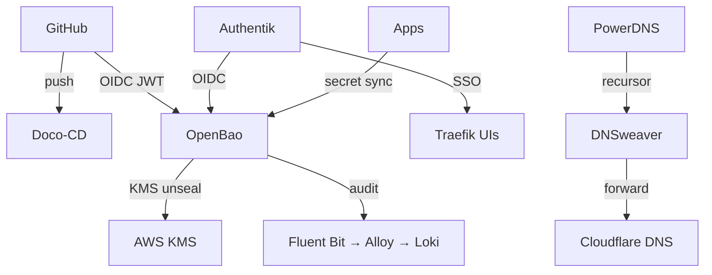
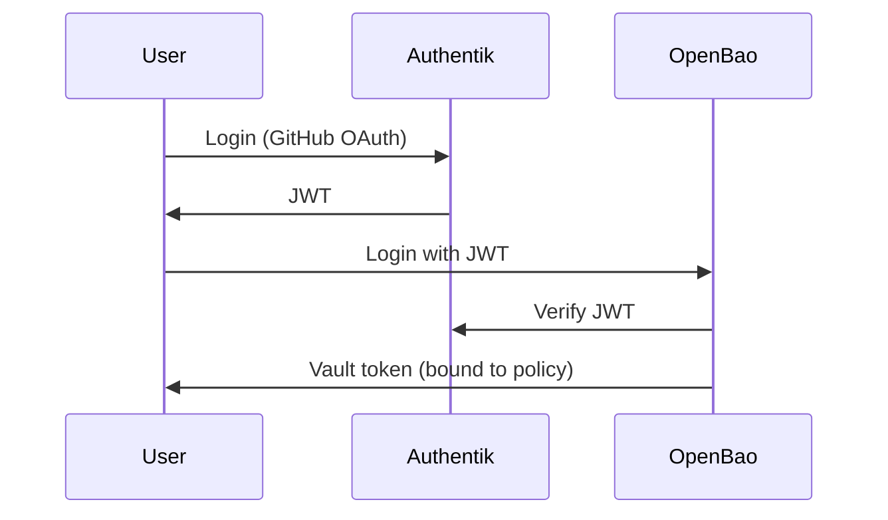
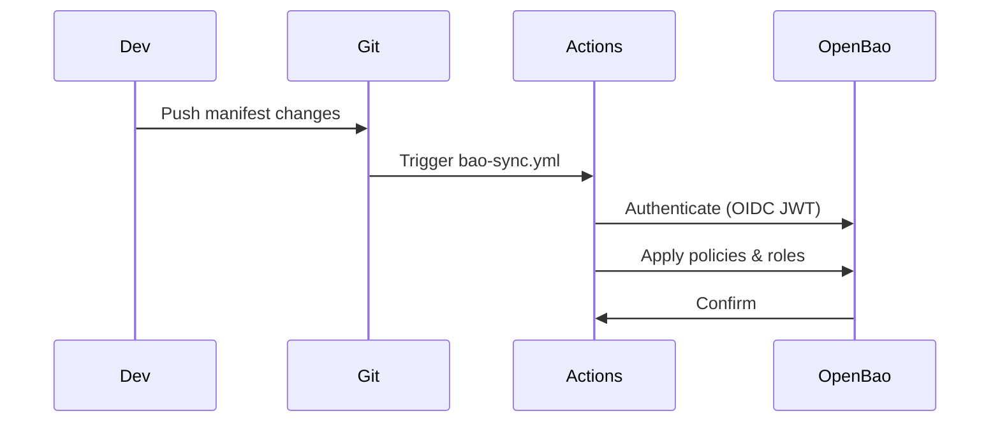

# Good Manners Hosting — Security Cluster

Automated security platform for Good Manners Hosting. Single Hetzner VPS running Docker Compose stacks for identity, secrets, DNS, and GitOps.

## Architecture



## Key Services

| Service | Host | Purpose |
|---------|------|---------|
| OpenBao | keeper.goodmanners.services | Secrets management, auto-unsealed by AWS KMS |
| Authentik | auth.goodmanners.services | Identity provider, GitHub SSO, OIDC |
| Doco-CD | doco-cd.goodmanners.services | GitOps, deploys from this repo on push |
| PowerDNS | pdns.goodmanners.services | Authoritative DNS |
| DNSweaver | dnsweaver.goodmanners.services | DNS filtering/recursor |
| Traefik | traefik.goodmanners.services | Ingress, TLS termination, dashboard |
| Poweradmin | poweradmin.goodmanners.services | PowerDNS web UI |
| Grafana/Loki/Alloy | — | Observability stack |

## Authentication Flow

1. **User login**: Authentik authenticates via GitHub OAuth
2. **OIDC to OpenBao**: Authentik exchanges JWT → OpenBao issues Vault token
3. **Role binding**: OpenBao roles map OIDC groups to policies
4. **Service auth**: GitHub Actions uses OIDC JWT; ESO syncs secrets via Kubernetes SA



## OpenBao Namespace Strategy

Multi-tenant namespace isolation for different environments:

| Namespace | Purpose | Prefix | Groups |
|-----------|---------|--------|--------|
| (root) | Global config, CI | — | keeper-* |
| homelab-enterprise | Production secrets | enterprise/ | enterprise-* |
| homelab-finance | Finance secrets | finance/ | finance-* |
| homelab-dan | Personal homelab secrets | dan/ | dan-* |

Each namespace has admin/operator/reader roles. Root uses keeper-* groups; namespaces use <prefix>-* groups.

## Git-Sync Process



**Manifests** (`bao/`):
- `policies/*.hcl` — root namespace policies
- `roles/*.json` — root namespace OIDC roles
- `namespaces/<ns>/policies/*.hcl` — namespace-specific policies
- `namespaces/<ns>/roles/*.json` — namespace-specific OIDC roles
- `jwt/*.json` — GitHub Actions JWT role
- `kubernetes/*.json` — Kubernetes SA roles

**Sync script**: `bao/sync-from-git.sh` — syncs all root and namespace policies/roles

## File Organization

```
cloud-security-cluster/
├── stacks/                  # Docker Compose stacks (one per service)
│   ├── openbao/             # OpenBao configuration
│   ├── authentik/           # Authentik configuration
│   ├── doco-cd/             # GitOps automation
│   ├── traefik/             # Ingress proxy
│   ├── powerdns/            # DNS server
│   └── ...
├── bao/                     # OpenBao manifests
│   ├── policies/            # Root namespace policies
│   ├── roles/               # Root namespace roles
│   ├── namespaces/          # Namespace-specific configs
│   ├── sync-from-git.sh     # Sync script
│   └── validate-sync.sh     # Validation script
├── infra/                   # Pulumi infrastructure
│   ├── aws/                 # AWS resources (KMS, etc.)
│   └── pulumi/              # Hetzner resources
├── authentik/               # Authentik blueprints
│   └── blueprints/          # Declarative identity config
├── .doco-cd.yml             # GitOps deploy configuration
└── README.md                # Detailed documentation
```

## Common Commands

```bash
# Validate manifests locally
bash bao/validate-sync.sh

# Sync to OpenBao (requires BAO_TOKEN)
export BAO_TOKEN=...
export AUTHENTIK_CLIENT_ID=KplhN1VOimANrHpy7h8DQINoy0KQQvx1Ig8PTxzH
bash bao/sync-from-git.sh

# Authenticate to OpenBao (interactive)
export BAO_ADDR=https://keeper.goodmanners.services
bao login -method=oidc role=admin

# Read secret
bao read -namespace=homelab-dan secret/dan/myapp

# Check namespace
bao namespace list
```

## Testing

**Local validation** (no server needed):
```bash
bash bao/validate-sync.sh
```

**CI validation** (on push):
- `.github/workflows/bao-sync.yml` triggers on `bao/**` changes
- Validates manifests, authenticates to OpenBao, applies changes
- Requires `AUTHENTIK_CLIENT_ID` GitHub Actions secret

## Key Design Decisions

1. **Single VPS, Compose-based**: Simpler than Kubernetes; easy to understand and maintain
2. **AWS KMS auto-unseal**: No manual unsealing; scales without human intervention
3. **Namespace isolation**: Different environments (prod, finance, personal) don't interfere
4. **Git-as-source-of-truth**: All configs, policies, and roles versioned in this repo
5. **OIDC-centric auth**: All authentication goes through Authentik + OIDC/JWT
6. **Declarative DNS**: DNSweaver config pushed via GitOps for automated DNS management